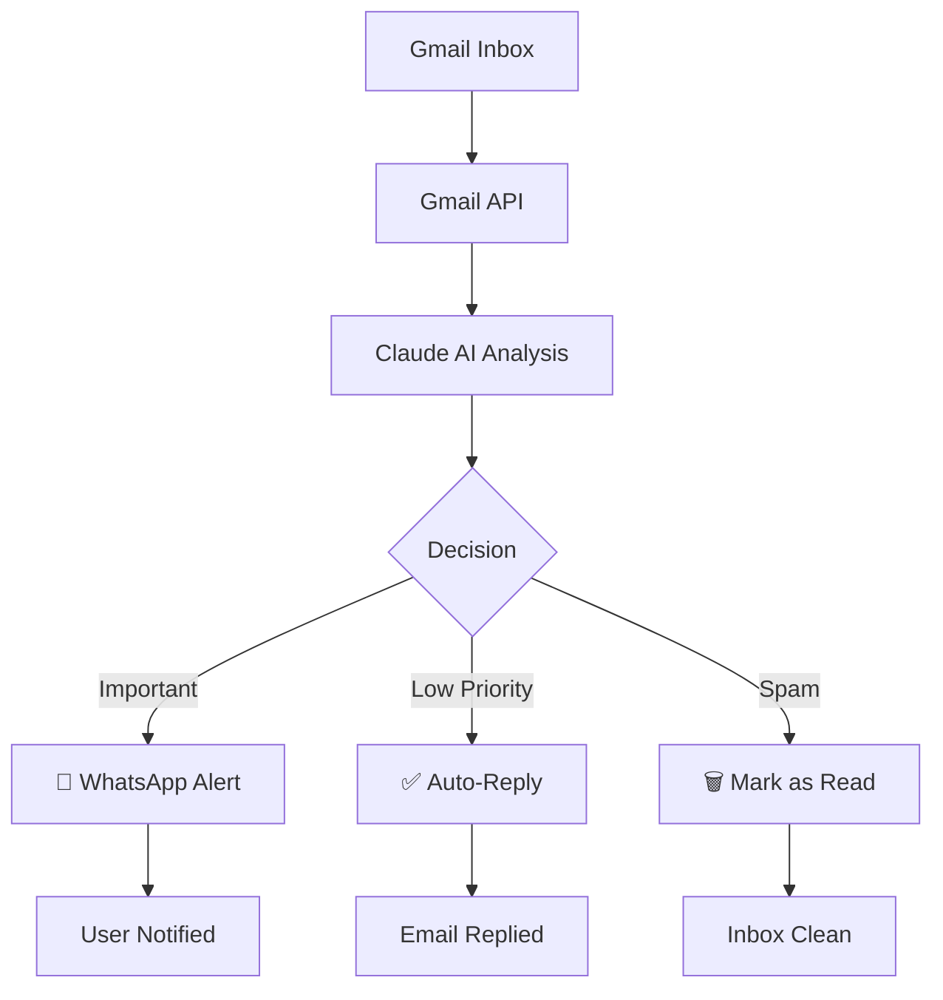

# 🤖 AI Gmail Agent

> Autonomous email management powered by Claude AI - Reads emails, sends WhatsApp alerts, auto-replies intelligently.

[](https://www.python.org/)
[](https://www.anthropic.com/)
[](LICENSE)

## 🎯 What It Does

An intelligent AI agent that manages your Gmail inbox autonomously:

- 📧 **Reads emails** from your Gmail every hour
- 🧠 **Analyzes** each email using Claude AI  
- 🚨 **Alerts** you on WhatsApp for important emails
- ✅ **Auto-replies** to low-priority messages
- 🗑️ **Filters** marketing/spam automatically
- 📊 **Real-time dashboard** to monitor everything

## 📊 Performance

From first run on real Gmail inbox:

| Metric | Value |
|--------|-------|
| 📧 Emails Processed | 10 |
| 🚨 Alerts Sent | 1 |
| 🗑️ Spam Filtered | 9 |
| 🎯 Accuracy | 90% |
| ⏱️ Time Saved | ~20 mins |

## 🎬 Demo


## 🛠️ Tech Stack

- **Python 3.11** - Core language
- **Claude AI (Anthropic)** - Email analysis & decision-making
- **Gmail API** - Email reading
- **Twilio** - WhatsApp messaging
- **Streamlit** - Web dashboard
- **GitHub Actions** - Cloud automation (runs 24/7)

## 📁 Project Structure

## 📁 Project Structure

| File | Description |
|------|-------------|
| `gmail_agent_real.py` | Main agent (reads, analyzes, acts) |
| `dashboard.py` | Streamlit dashboard |
| `agent_rules.json` | Your custom rules |
| `requirements.txt` | Python dependencies |
| `.gitignore` | Git ignore rules |
| `README.md` | This file |


## 🚀 How It Works

## 🚀 How It Works



## ⚙️ Setup

### 1. Clone Repository

```bash
git clone https://github.com/YOUR_USERNAME/ai-gmail-agent.git
cd ai-gmail-agent
```

### 2. Install Dependencies

```bash
pip install -r requirements.txt
```

### 3. Configure Gmail API

1. Go to [Google Cloud Console](https://console.cloud.google.com/)
2. Create new project
3. Enable Gmail API
4. Create OAuth 2.0 credentials
5. Download as `credentials.json`

### 4. Configure Anthropic API

Create `.env` file:

Get your key: [console.anthropic.com](https://console.anthropic.com)

### 5. Configure WhatsApp (Optional)

Create `whatsapp_config.json`:

```json
{
  "account_sid": "your_twilio_sid",
  "auth_token": "your_twilio_token",
  "from_number": "+14155238886",
  "to_number": "+your_number"
}
```

Get credentials from [Twilio Console](https://console.twilio.com)

### 6. Customize Rules

Edit `agent_rules.json` to define:
- Which emails to **alert**
- Which to **auto-reply**
- Which to **ignore**

### 7. Run Agent

```bash
python gmail_agent_real.py
```

### 8. View Dashboard

```bash
streamlit run dashboard.py
```

Open: http://localhost:8501

## 📋 Custom Rules Example

```json
{
  "alert_rules": [
    "Email from real recruiter offering job opportunity",
    "Email asking user to send specific document",
    "Urgent emails from known contacts"
  ],
  "reply_rules": [
    "Generic order confirmation",
    "Automated system notifications"
  ],
  "ignore_rules": [
    "Marketing and promotional emails",
    "Newsletter and digest emails",
    "Social media notifications"
  ]
}
```

## 🎨 Features

### 🤖 Intelligent Decision Making
- Uses Claude AI for context-aware decisions
- No keyword matching or regex
- Understands intent, not just patterns

### 📱 Real-Time Alerts
- WhatsApp notifications for important emails
- Customizable alert messages
- Never miss critical emails

### 📊 Live Dashboard
- Real-time stats and metrics
- Email distribution charts
- Action history
- Beautiful, professional UI

### ⏰ Cloud Automation
- Runs 24/7 via GitHub Actions
- No need to keep laptop on
- 100% free tier sufficient

### 🔒 Privacy First
- All credentials stored locally
- No data sent to third parties (except Claude API)
- Open source - audit yourself

## 🎯 Use Cases

- **Busy Professionals** - Never miss important emails buried in spam
- **Job Seekers** - Get instant alerts for recruiter messages
- **Students** - Filter university emails from marketing
- **Entrepreneurs** - Auto-handle order confirmations & FAQs
- **Anyone with Gmail overload!**

## 🚀 Cloud Deployment

This agent runs autonomously using **GitHub Actions** (FREE).

The workflow runs every hour automatically. See `.github/workflows/agent.yml`

## 🤝 Contributing

Pull requests welcome! For major changes, please open an issue first.

## 📝 License

MIT License - feel free to use this for personal projects

## 🙏 Acknowledgments

- [Anthropic](https://anthropic.com) for Claude AI
- [Google](https://developers.google.com/gmail) for Gmail API
- [Twilio](https://twilio.com) for WhatsApp messaging
- [Streamlit](https://streamlit.io) for amazing dashboard framework

## 📞 Connect

- GitHub: [@saipriyadama](https://github.com/YOUR_USERNAME)
- LinkedIn: [sai priya](www.linkedin.com/in/sai-priya-a-60093b1b4)

## 🌟 Star this repo if you find it useful!

---

**Built with ❤️ using Python and Claude AI**
